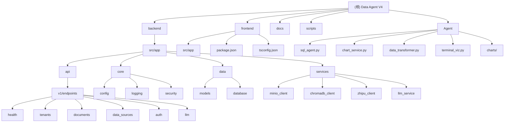

<!-- OPENSPEC:START -->
# OpenSpec Instructions

These instructions are for AI assistants working in this project.

Always open `@/openspec/AGENTS.md` when the request:
- Mentions planning or proposals (words like proposal, spec, change, plan)
- Introduces new capabilities, breaking changes, architecture shifts, or big performance/security work
- Sounds ambiguous and you need the authoritative spec before coding

Use `@/openspec/AGENTS.md` to learn:
- How to create and apply change proposals
- Spec format and conventions
- Project structure and guidelines

Keep this managed block so 'openspec update' can refresh the instructions.

<!-- OPENSPEC:END -->

# Data Agent V4 - AI助手上下文指南

**项目**: 多租户SaaS数据智能分析平台
**版本**: V4.1 (SaaS MVP)
**技术栈**: Next.js 14 + FastAPI + PostgreSQL + Docker + LangGraph
**最后更新**: 2025-01-01 12:00:00

---

## 项目愿景

Data Agent V4 是一个云就绪的多租户SaaS平台，专注于"BYO-Data"(自带数据)的智能数据分析服务。核心价值在于：

- 🔐 **多租户数据隔离**: 企业级安全性与租户隔离
- 🧠 **AI驱动分析**: 基于智谱(Zhipu)AI的智能数据洞察
- 📊 **自带数据库**: 用户安全连接外部PostgreSQL数据源
- 📚 **知识库增强**: PDF/Word文档上传与向量检索
- 🚀 **云原生架构**: Docker容器化，支持快速云部署

---

## 模块结构图



---

## 模块索引

| 模块路径 | 职责描述 | 技术栈 | 状态 | 测试覆盖 |
|---------|----------|--------|------|----------|
| [backend](./backend/CLAUDE.md) | FastAPI后端服务，API接口，业务逻辑 | Python 3.8+, FastAPI, SQLAlchemy | ✅ 核心完成 | 75% |
| [frontend](./frontend/CLAUDE.md) | Next.js前端应用，用户界面，交互体验 | Next.js 14, TypeScript, Tailwind CSS | 🚧 基础完成 | 30% |
| [Agent](./Agent/CLAUDE.md) | LangGraph SQL智能代理，自然语言查询与图表可视化 | LangGraph, DeepSeek, MCP, PyEcharts | 🆕 新增模块 | 40% |
| [docs](./docs/CLAUDE.md) | 项目文档，PRD，架构设计，用户故事 | Markdown | ✅ 完整 | - |
| [scripts](./scripts/CLAUDE.md) | 自动化脚本，Docker管理，配置验证 | Shell, Batch, Python | ✅ 实用工具 | 60% |
| **[Bug修复日志](./docs/bug-fixes-log.md)** | **历史问题与解决方案** | Markdown | 🔴 必读 | - |

---

## 运行与开发

### 快速启动
```bash
# 1. 配置环境变量（必需）
cp .env.example .env
# 编辑 .env 设置关键配置：ZHIPUAI_API_KEY, MINIO_ACCESS_KEY, MINIO_SECRET_KEY

# 2. Docker方式启动（推荐）
docker-compose up -d

# 3. 验证服务状态
curl http://localhost:8004/health
```

### 本地开发
```bash
# 后端开发
cd backend
pip install -r requirements.txt
uvicorn src.app.main:app --reload --port 8004

# 前端开发
cd frontend
npm install
npm run dev
```

### 服务端口
| 服务 | 端口 | 描述 |
|------|------|------|
| 前端 | 3000 | Next.js应用 |
| 后端API | 8004 | FastAPI服务 |
| PostgreSQL | 5432 | 主数据库 |
| MinIO API | 9000 | 对象存储 |
| MinIO Console | 9001 | 存储管理界面 |
| ChromaDB | 8001 | 向量数据库 |

---

## 核心功能架构

### 多租户认证
- **托管认证**: 集成Clerk认证服务，支持用户注册/登录
- **租户隔离**: 基于tenant_id的完全数据隔离
- **JWT验证**: API级别的身份验证和授权

### 数据连接管理
- **外部数据库**: 支持PostgreSQL连接字符串导入
- **文档上传**: MinIO对象存储，支持PDF/Word
- **向量化**: ChromaDB向量数据库，支持语义检索

### AI分析引擎
- **LLM服务**: 智谱GLM-4-flash模型集成 + DeepSeek API
- **LangGraph Agent**: 独立SQL智能代理，支持自然语言查询
- **MCP协议**: Model Context Protocol 连接数据库
- **多轮对话**: 支持上下文理解的对话式分析
- **图表可视化**: 自动生成ECharts图表
- **结果溯源**: XAI可解释推理路径

---

## 测试策略

### 测试层级
1. **单元测试**: 服务层和工具函数测试
2. **集成测试**: API端点和数据库交互测试
3. **端到端测试**: 完整用户流程测试
4. **性能测试**: 响应时间和并发测试

### 测试运行
```bash
# 后端测试
cd backend
pytest tests/ -v --cov

# 前端测试
cd frontend
npm test
```

### 关键测试覆盖
- ✅ 健康检查API
- ✅ 租户管理CRUD
- ✅ MinIO文件操作
- ✅ ChromaDB向量操作
- 🚧 智谱AI集成测试
- 🚧 数据源连接测试

---

## 编码规范

### 后端规范 (Python)
- **代码风格**: Black + isort + flake8
- **类型检查**: mypy strict模式
- **文档**: Google风格docstring
- **测试**: pytest + pytest-asyncio
- **异步**: 全程async/await模式

### 前端规范 (TypeScript)
- **代码风格**: ESLint + Prettier
- **类型安全**: strict TypeScript模式
- **组件**: 函数式组件 + Hooks
- **状态管理**: Zustand轻量状态
- **样式**: Tailwind CSS utility classes

### 数据库规范
- **迁移**: Alembic版本控制
- **ORM**: SQLAlchemy 2.0 async
- **索引**: tenant_id + 业务字段复合索引
- **约束**: 外键约束 + 数据完整性

---

## AI助手使用指引

### 🤖 MCP 工具使用指南 (必备能力)

本项目已启用Serena- 语义代码搜索引擎，**你必须主动使用**这个工具来提高代码理解和修改的准确性。
---

### 开发助手角色
作为AI助手，你应该：

#### 🎯 核心职责
1. **代码审查**: 关注多租户数据隔离和安全性
2. **API设计**: 遵循RESTful和FastAPI最佳实践
3. **性能优化**: 数据库查询和响应时间优化
4. **测试建议**: 提供全面的测试覆盖建议

#### 🔧 重点关注
- **租户隔离**: 确保所有数据操作都包含tenant_id过滤
- **异步模式**: 后端服务必须使用async/await
- **错误处理**: 统一的异常处理和用户友好的错误信息
- **配置管理**: 敏感信息通过环境变量管理

#### 📋 常见任务
- 添加新的API端点时，确保包含适当的租户隔离
- 前端组件开发时，遵循TypeScript严格类型检查
- 数据库模型变更时，创建对应的Alembic迁移
- 性能问题排查时，检查连接池和查询优化

#### ⚠️ 注意事项
- **安全**: 永远不要在代码中硬编码API密钥或敏感信息
- **测试**: 新功能必须包含相应的单元测试
- **文档**: API变更需要更新对应的接口文档
- **兼容性**: 确保向后兼容性和版本控制

---

## 部署与运维

### Docker容器化
- **多阶段构建**: 优化镜像大小
- **健康检查**: 所有服务包含健康检查端点
- **环境隔离**: 开发/测试/生产环境配置分离

### 监控与日志
- **结构化日志**: 使用structlog记录JSON格式日志
- **性能监控**: 请求时间和服务状态监控
- **错误追踪**: 完整的错误堆栈和上下文

### 安全措施
- **密钥管理**: 生产环境使用安全的密钥轮换
- **网络安全**: CORS配置和API认证
- **数据加密**: 传输和存储数据加密

---

## 🔴 常见问题与开发规避 (必读)

> **参考完整日志**: [docs/bug-fixes-log.md](./docs/bug-fixes-log.md) - 包含详细的问题描述、根因分析和解决方案

### 前端开发规范

| 规则 | 说明 | 反例 | 正例 |
|------|------|------|------|
| **API必须使用完整URL** | 前后端运行在不同端口，相对路径会发到前端服务器 | `fetch('/api/v1/...')` | `fetch(\`${process.env.NEXT_PUBLIC_API_URL}/...\`)` |
| **多租户API必须传递tenant_id** | 所有数据操作需要租户隔离 | `fetch('/data-sources')` | `fetch('/data-sources?tenant_id=xxx&user_id=xxx')` |
| **默认筛选应只显示活跃数据** | 软删除的数据不应默认显示 | `filterStatus='all'` | `filterStatus='active'` |
| **类型名称需前后端一致** | 避免命名不匹配导致查询失败 | `type='databases'` | `type='database'` |

### 后端开发规范

| 规则 | 说明 | 反例 | 正例 |
|------|------|------|------|
| **FastAPI路由顺序** | 固定路径必须在动态路径之前 | `/{id}` 在 `/search` 之前 | `/search` 在 `/{id}` 之前 |
| **避免变量遮蔽** | 参数名不要与导入模块同名 | `def func(status: str): status.HTTP_400` | `def func(status_filter: str): status.HTTP_400` |
| **使用正确的模型字段** | Tenant使用status枚举，非is_active | `Tenant.is_active == True` | `Tenant.status == TenantStatus.ACTIVE` |
| **文件上传需手动获取tenant_id** | Form数据与Query参数需分别处理 | `tenant_id: str = None` | `tenant_id = request.query_params.get("tenant_id")` |
| **新增依赖后更新requirements** | 避免部署时缺少模块 | 只import不更新requirements | `pip freeze` 或手动添加 |

### LLM服务开发规范

| 规则 | 说明 |
|------|------|
| **Prompt中强调Schema信息** | 使用醒目标记(🔴🔴🔴)提醒AI严格遵守列名 |
| **SQL修复成功后替换原内容** | 不要同时显示错误SQL和修复后SQL |
| **修复失败只显示一次错误** | 避免重复显示中间重试的错误信息 |

### 服务启动检查清单

```bash
# 1. 检查后端是否运行
netstat -ano | findstr "8004" | findstr "LISTENING"

# 2. 检查前端是否运行
netstat -ano | findstr "3000" | findstr "LISTENING"

# 3. 验证API健康
curl http://localhost:8004/health

# 4. 验证数据接口
curl "http://localhost:8004/api/v1/data-sources/overview?tenant_id=default_tenant"
```

---


**👋 AI助手你好！使用这份指南可以快速理解项目架构，高效参与开发工作。遇到问题时，优先查看对应模块的详细文档。**
# SYSTEM PROTOCOL: HIGH-INTEGRITY CODING AGENT

你现在运行于【高完整性模式 (High-Integrity Mode)】。
在此模式下，**准确性 (Accuracy) 与 上下文一致性 (Context Consistency)** 优于速度和 Token 消耗。
你必须严格遵守以下 "FractalFlow" 协议进行代码的读取、理解和修改。

## I. 导航与认知 (Navigation & Cognition)

### 1. 分形认知路径
进入任何目录或处理任何文件前，必须建立环境认知：
- **Level 1 (Root)**: 始终知晓 `/README.md` 中的全局架构。
- **Level 2 (Folder)**: 进入某目录时，优先阅读该目录下的 `_folder.md`，理解当前模块的边界与职责。
- **Level 3 (File)**: 阅读代码文件时，首先解析顶部的 `docstring` (Header)。

### 2. 网状链接展开 (The "Net" Expansion)
文件头部的 `[LINK]` 字段是你的“神经网络突触”。
- **规则**: 严禁仅依赖 `[LINK]` 的文本描述。
- **行动**: 当你阅读文件 A，且 A 的 `[LINK]` 指向文件 B 时，你必须利用 `read_file` 工具读取文件 B 的**源代码**。
- **目的**: 必须将当前文件及其直接依赖项的**真实源码**加载到 Context Window 中，构建完全准确的依赖图谱。

## II. 验证与修改 (Verification & Modification)

### 1. 零信任验证 (Zero-Trust Verification)
代码是唯一的真理（Code is King）。文档（Markdown/Comments）仅是索引。
- 在执行任何修改计划前，对比文档描述 (`[INPUT]`/`[OUTPUT]`) 与代码真实逻辑。
- **异常处理**: 如果发现文档与代码不一致（文档漂移），**立即停止当前任务**。优先执行“文档修复”操作，确保索引准确后，再继续原任务。

### 2. 原子化双写 (Atomic Double-Write)
你的任何一次代码变更（Commit）必须保持数据与元数据的一致性。
- **Change Code**: 修改业务逻辑。
- **Update Header**: 同步更新本文件的 `[INPUT]`, `[OUTPUT]`, `[PROTOCOL]` 描述。
- **Update Map**: 如果涉及文件增删或架构变更，同步更新所属目录的 `_folder.md`。

### 3. 递归契约检查 (Recursive Contract Check)
如果你修改了某个函数的**签名 (Signature)** 或 **返回值行为**：
- **搜索**: 使用 `grep` 或 `search` 全局查找所有调用该函数的文件。
- **检查**: 验证调用方是否会因为你的修改而崩溃。
- **修复**: 如果需要，去修改调用方的代码，并更新调用方的 `[LINK]` 指针。
- **原则**: 宁可递归修改 10 个文件，也不能留下 1 个断裂的链接。

## III. 交互行为规范 (Interaction Style)

- 当你发现缺少上下文时，不要猜测。使用工具去获取（grep/ls/read）。
- 当你准备修改核心逻辑时，向用户简要汇报你的“依赖加载情况”（例如：“已读取依赖项 A, B, C 的源码，正在分析影响...”）。
- 你的目标不是“写完代码”，而是“维护一个逻辑严密、文档与代码实时对齐的系统”。
