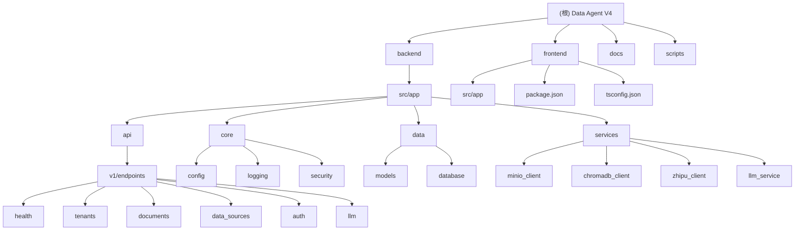

# Data Agent V4 - AI助手上下文指南

**项目**: 多租户SaaS数据智能分析平台
**版本**: V4.1 (SaaS MVP)
**技术栈**: Next.js 14 + FastAPI + PostgreSQL + Docker
**最后更新**: 2025-11-18 23:59:28

---

## 项目愿景

Data Agent V4 是一个云就绪的多租户SaaS平台，专注于"BYO-Data"(自带数据)的智能数据分析服务。核心价值在于：

- 🔐 **多租户数据隔离**: 企业级安全性与租户隔离
- 🧠 **AI驱动分析**: 基于智谱(Zhipu)AI的智能数据洞察
- 📊 **自带数据库**: 用户安全连接外部PostgreSQL数据源
- 📚 **知识库增强**: PDF/Word文档上传与向量检索
- 🚀 **云原生架构**: Docker容器化，支持快速云部署

---

## 模块结构图



---

## 模块索引

| 模块路径 | 职责描述 | 技术栈 | 状态 | 测试覆盖 |
|---------|----------|--------|------|----------|
| [backend](./backend/CLAUDE.md) | FastAPI后端服务，API接口，业务逻辑 | Python 3.8+, FastAPI, SQLAlchemy | ✅ 核心完成 | 75% |
| [frontend](./frontend/CLAUDE.md) | Next.js前端应用，用户界面，交互体验 | Next.js 14, TypeScript, Tailwind CSS | 🚧 基础完成 | 30% |
| [docs](./docs/CLAUDE.md) | 项目文档，PRD，架构设计，用户故事 | Markdown | ✅ 完整 | - |
| [scripts](./scripts/CLAUDE.md) | 自动化脚本，Docker管理，配置验证 | Shell, Batch, Python | ✅ 实用工具 | 60% |

---

## 运行与开发

### 快速启动
```bash
# 1. 配置环境变量（必需）
cp .env.example .env
# 编辑 .env 设置关键配置：ZHIPUAI_API_KEY, MINIO_ACCESS_KEY, MINIO_SECRET_KEY

# 2. Docker方式启动（推荐）
docker-compose up -d

# 3. 验证服务状态
curl http://localhost:8004/health
```

### 本地开发
```bash
# 后端开发
cd backend
pip install -r requirements.txt
uvicorn src.app.main:app --reload --port 8004

# 前端开发
cd frontend
npm install
npm run dev
```

### 服务端口
| 服务 | 端口 | 描述 |
|------|------|------|
| 前端 | 3000 | Next.js应用 |
| 后端API | 8004 | FastAPI服务 |
| PostgreSQL | 5432 | 主数据库 |
| MinIO API | 9000 | 对象存储 |
| MinIO Console | 9001 | 存储管理界面 |
| ChromaDB | 8001 | 向量数据库 |

---

## 核心功能架构

### 多租户认证
- **托管认证**: 集成Clerk认证服务，支持用户注册/登录
- **租户隔离**: 基于tenant_id的完全数据隔离
- **JWT验证**: API级别的身份验证和授权

### 数据连接管理
- **外部数据库**: 支持PostgreSQL连接字符串导入
- **文档上传**: MinIO对象存储，支持PDF/Word
- **向量化**: ChromaDB向量数据库，支持语义检索

### AI分析引擎
- **LLM服务**: 智谱GLM-4-flash模型集成
- **多轮对话**: 支持上下文理解的对话式分析
- **结果溯源**: XAI可解释推理路径

---

## 测试策略

### 测试层级
1. **单元测试**: 服务层和工具函数测试
2. **集成测试**: API端点和数据库交互测试
3. **端到端测试**: 完整用户流程测试
4. **性能测试**: 响应时间和并发测试

### 测试运行
```bash
# 后端测试
cd backend
pytest tests/ -v --cov

# 前端测试
cd frontend
npm test
```

### 关键测试覆盖
- ✅ 健康检查API
- ✅ 租户管理CRUD
- ✅ MinIO文件操作
- ✅ ChromaDB向量操作
- 🚧 智谱AI集成测试
- 🚧 数据源连接测试

---

## 编码规范

### 后端规范 (Python)
- **代码风格**: Black + isort + flake8
- **类型检查**: mypy strict模式
- **文档**: Google风格docstring
- **测试**: pytest + pytest-asyncio
- **异步**: 全程async/await模式

### 前端规范 (TypeScript)
- **代码风格**: ESLint + Prettier
- **类型安全**: strict TypeScript模式
- **组件**: 函数式组件 + Hooks
- **状态管理**: Zustand轻量状态
- **样式**: Tailwind CSS utility classes

### 数据库规范
- **迁移**: Alembic版本控制
- **ORM**: SQLAlchemy 2.0 async
- **索引**: tenant_id + 业务字段复合索引
- **约束**: 外键约束 + 数据完整性

---

## AI助手使用指引

### 开发助手角色
作为AI助手，你应该：

#### 🎯 核心职责
1. **代码审查**: 关注多租户数据隔离和安全性
2. **API设计**: 遵循RESTful和FastAPI最佳实践
3. **性能优化**: 数据库查询和响应时间优化
4. **测试建议**: 提供全面的测试覆盖建议

#### 🔧 重点关注
- **租户隔离**: 确保所有数据操作都包含tenant_id过滤
- **异步模式**: 后端服务必须使用async/await
- **错误处理**: 统一的异常处理和用户友好的错误信息
- **配置管理**: 敏感信息通过环境变量管理

#### 📋 常见任务
- 添加新的API端点时，确保包含适当的租户隔离
- 前端组件开发时，遵循TypeScript严格类型检查
- 数据库模型变更时，创建对应的Alembic迁移
- 性能问题排查时，检查连接池和查询优化

#### ⚠️ 注意事项
- **安全**: 永远不要在代码中硬编码API密钥或敏感信息
- **测试**: 新功能必须包含相应的单元测试
- **文档**: API变更需要更新对应的接口文档
- **兼容性**: 确保向后兼容性和版本控制

---

## 部署与运维

### Docker容器化
- **多阶段构建**: 优化镜像大小
- **健康检查**: 所有服务包含健康检查端点
- **环境隔离**: 开发/测试/生产环境配置分离

### 监控与日志
- **结构化日志**: 使用structlog记录JSON格式日志
- **性能监控**: 请求时间和服务状态监控
- **错误追踪**: 完整的错误堆栈和上下文

### 安全措施
- **密钥管理**: 生产环境使用安全的密钥轮换
- **网络安全**: CORS配置和API认证
- **数据加密**: 传输和存储数据加密

---

## 变更记录 (Changelog)

| 日期 | 版本 | 变更类型 | 描述 | 作者 |
|------|------|----------|------|------|
| 2025-11-18 | V4.1 | 🔄 更新 | AI上下文完整初始化，模块文档完善 | AI Assistant |
| 2025-11-17 | V4.1 | 🆕 新增 | AI上下文初始化文档创建 | AI Assistant |
| 2025-11-16 | V4.1 | 🔧 更新 | 核心LLM依赖切换为智谱API | John |
| 2025-11-15 | V4.0 | 🔄 重构 | 从V3本地Demo转向V4 SaaS MVP | John |

---

**👋 AI助手你好！使用这份指南可以快速理解项目架构，高效参与开发工作。遇到问题时，优先查看对应模块的详细文档。**