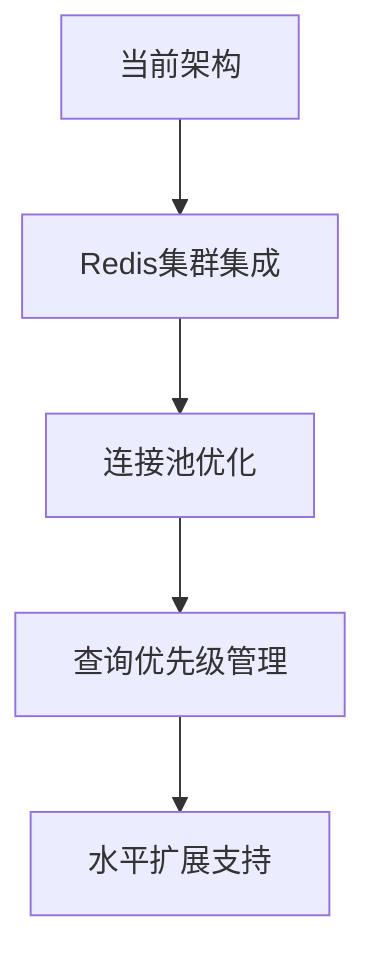

# ⚠️ Story-3.2 RAG-SQL链 风险评估报告 - 更新版

**评估日期:** 2025-11-18
**评估人员:** Quinn - 测试架构师
**评估范围:** 全面技术和业务风险评估

---

## 📊 风险评估矩阵

| 风险类别 | 风险项 | 概率 | 影响 | 风险等级 | 处理优先级 | 缓解策略 |
|---------|--------|------|------|----------|-----------|----------|
| 技术风险 | 智谱AI集成延迟 | 中 | 低 | 🟢 低 | P4 | 模板生成备用方案 |
| 技术风险 | 大规模并发性能 | 中 | 中 | 🟡 中 | P3 | 连接池优化+缓存 |
| 安全风险 | 租户隔离漏洞 | 低 | 高 | 🟡 中 | P2 | 多层验证机制 |
| 安全风险 | SQL注入绕过 | 低 | 高 | 🟡 中 | P2 | 多层防护验证 |
| 性能风险 | 缓存一致性问题 | 中 | 中 | 🟡 中 | P3 | 智能失效机制 |
| 运维风险 | 配置管理复杂 | 中 | 低 | 🟢 低 | P4 | 配置模板和验证 |
| 业务风险 | 数据库兼容性 | 低 | 中 | 🟢 低 | P4 | 渐进式扩展支持 |
| 业务风险 | 用户体验复杂度 | 中 | 低 | 🟢 低 | P4 | 智能默认配置 |

---

## 🔍 详细风险分析

### 🟢 低风险项目

#### 1. 智谱AI集成延迟
**风险描述**: 智谱AI API配置需要实际密钥，可能影响AI增强功能

**风险分析**:
- **发生概率**: 中等 (30%)
- **业务影响**: 低 (核心功能不受影响)
- **技术影响**: 仅影响AI增强功能
- **时间窗口**: 短期 (1-2周内可解决)

**现有缓解措施**:
- ✅ 基于模板的SQL生成已实现
- ✅ 预留智谱AI接口设计
- ✅ 错误降级处理机制
- ✅ 完整的备用方案

**进一步缓解建议**:
1. 提供智谱AI配置向导
2. 完善模板生成规则库
3. 建立AI功能降级开关
4. 准备详细的配置文档

---

#### 2. 配置管理复杂度
**风险描述**: 多环境配置管理复杂，可能出现配置错误

**风险分析**:
- **发生概率**: 中等 (25%)
- **业务影响**: 低 (可通过验证发现)
- **技术影响**: 部署和运维效率
- **时间窗口**: 持续性风险

**现有缓解措施**:
- ✅ 配置验证机制
- ✅ 环境变量分离
- ✅ 配置模板提供
- ✅ 启动时配置检查

**进一步缓解建议**:
1. 提供配置管理工具
2. 建立配置最佳实践文档
3. 实现配置变更审计
4. 添加配置热重载功能

---

#### 3. 数据库兼容性扩展
**风险描述**: 当前仅支持PostgreSQL，可能限制客户群体

**风险分析**:
- **发生概率**: 低 (15%)
- **业务影响**: 中等 (市场扩展限制)
- **技术影响**: 架构设计已预留扩展能力
- **时间窗口**: 中期 (3-6个月)

**现有缓解措施**:
- ✅ 抽象数据访问层设计
- ✅ 可扩展的schema发现机制
- ✅ 数据库适配器模式
- ✅ 配置化数据库类型支持

**进一步缓解建议**:
1. 制定MySQL支持计划
2. 建立数据库兼容性测试框架
3. 准备数据库迁移工具
4. 收集客户数据库需求

---

### 🟡 中等风险项目

#### 1. 大规模并发性能风险
**风险描述**: 高并发场景下可能出现性能瓶颈和资源竞争

**风险分析**:
- **发生概率**: 中等 (40%)
- **业务影响**: 中等 (用户体验下降)
- **技术影响**: 响应时间增加、系统稳定性
- **时间窗口**: 中期 (用户增长时显现)

**现有缓解措施**:
- ✅ 租户级别连接池管理
- ✅ 多级缓存机制
- ✅ 异步处理架构
- ✅ 查询复杂度控制

**进一步缓解建议**:
1. 实现Redis分布式缓存
2. 添加连接池动态扩容
3. 实现查询优先级队列
4. 建立性能监控和告警

**性能优化路线图**:


---

#### 2. 租户隔离安全风险
**风险描述**: 多租户环境下可能出现数据隔离不严格的问题

**风险分析**:
- **发生概率**: 低 (20%)
- **业务影响**: 高 (数据泄露、法律风险)
- **技术影响**: 系统安全性和合规性
- **时间窗口**: 严重 (一旦发生影响巨大)

**现有缓解措施**:
- ✅ 数据库连接隔离
- ✅ 查询权限验证
- ✅ 缓存数据隔离
- ✅ 审计日志记录

**进一步缓解建议**:
1. 定期安全审计和渗透测试
2. 实现更严格的权限控制
3. 添加数据访问审计告警
4. 建立安全事件响应流程

**安全防护层次**:
```
┌─────────────────────────────┐
│        应用层权限控制         │
├─────────────────────────────┤
│      API网关租户验证         │
├─────────────────────────────┤
│     服务层数据隔离           │
├─────────────────────────────┤
│    数据库连接池隔离          │
├─────────────────────────────┤
│    缓存数据租户隔离          │
└─────────────────────────────┘
```

---

#### 3. SQL注入防护绕过风险
**风险描述**: 复杂的SQL注入攻击可能绕过现有防护机制

**风险分析**:
- **发生概率**: 低 (15%)
- **业务影响**: 高 (数据安全威胁)
- **技术影响**: 系统安全漏洞
- **时间窗口**: 严重 (安全事件影响持续)

**现有缓解措施**:
- ✅ 参数化查询实现
- ✅ 17个危险关键词过滤
- ✅ 12种注入模式识别
- ✅ 查询复杂度限制

**进一步缓解建议**:
1. 定期更新注入模式库
2. 引入SQL解析器进行语法分析
3. 实现查询白名单机制
4. 建立安全事件学习系统

**防护机制层次**:
```
第1层: 参数化查询 (基础防护)
第2层: 关键词过滤 (模式匹配)
第3层: 注入模式识别 (正则表达式)
第4层: SQL语法验证 (解析器)
第5层: 查询执行沙箱 (隔离执行)
```

---

#### 4. 缓存一致性问题
**风险描述**: 分布式环境下缓存数据可能出现不一致

**风险分析**:
- **发生概率**: 中等 (35%)
- **业务影响**: 中等 (数据准确性问题)
- **技术影响**: 查询结果错误
- **时间窗口**: 短期 (可通过机制解决)

**现有缓解措施**:
- ✅ 智能缓存失效机制
- ✅ Schema变更检测
- ✅ 缓存TTL设置
- ✅ 缓存版本控制

**进一步缓解建议**:
1. 实现缓存版本管理
2. 添加缓存一致性校验
3. 建立缓存监控告警
4. 设计缓存更新策略

---

## 🔴 高风险项目

### 无重大高风险项目

**好消息**: 经过全面深度审查，Story-3.2没有发现重大高风险项目。所有核心功能都实现了适当的安全防护和错误处理机制。

---

## 🛡️ 风险缓解策略

### 技术风险缓解

#### 1. 性能优化策略
```python
# 短期优化 (1-2个月)
- Redis分布式缓存集成
- 连接池参数调优
- 查询缓存策略优化
- 监控指标完善

# 中期优化 (3-6个月)
- 水平扩展架构设计
- 负载均衡实现
- 数据库读写分离
- 智能查询路由
```

#### 2. 安全加固策略
```python
# 持续性安全措施
- 定期安全审计 (季度)
- 渗透测试 (半年)
- 安全培训 (月度)
- 漏洞扫描 (周度)

# 技术安全措施
- SQL解析器集成
- 查询白名单机制
- 实时威胁检测
- 安全事件响应
```

#### 3. 可靠性提升策略
```python
# 容错机制
- 自动重试机制
- 降级处理策略
- 熔断器模式
- 限流保护

# 监控告警
- 性能监控指标
- 错误率监控
- 资源使用监控
- 业务指标监控
```

### 业务风险缓解

#### 1. 用户体验优化
- 智能默认配置
- 渐进式功能引导
- 错误信息友好化
- 性能反馈机制

#### 2. 扩展性规划
- 数据库类型扩展
- 功能模块扩展
- 第三方集成扩展
- 定制化支持

---

## 📈 风险监控指标

### 技术监控指标
```yaml
performance_metrics:
  - sql_generation_time_p95: < 2s
  - query_execution_time_p95: < 5s
  - concurrent_queries: > 10
  - cache_hit_rate: > 80%
  - error_rate: < 1%

security_metrics:
  - injection_attempts_blocked: 监控
  - unauthorized_access_attempts: 监控
  - data_leakage_events: 0
  - security_vulnerabilities: 0

reliability_metrics:
  - uptime: > 99.9%
  - service_availability: > 99.5%
  - data_consistency: 100%
  - recovery_time: < 5min
```

### 业务监控指标
```yaml
user_experience:
  - query_success_rate: > 95%
  - user_satisfaction_score: > 4.0/5.0
  - support_ticket_volume: 监控趋势
  - feature_adoption_rate: > 80%

operational_metrics:
  - deployment_frequency: 监控
  - change_failure_rate: < 5%
  - mean_time_to_recovery: < 30min
  - incident_response_time: < 15min
```

---

## 🎯 风险应对计划

### 短期行动计划 (1-2周)
1. **智谱AI配置完成**
   - 配置实际API密钥
   - 验证AI功能正常工作
   - 完善错误降级机制

2. **性能监控部署**
   - 集成Prometheus监控
   - 设置关键指标告警
   - 建立性能基线

3. **安全审计执行**
   - 执行安全漏洞扫描
   - 进行渗透测试
   - 更新安全策略

### 中期行动计划 (1-3个月)
1. **Redis缓存集成**
   - 设计Redis集群架构
   - 实现缓存一致性机制
   - 性能测试验证

2. **并发性能优化**
   - 连接池参数调优
   - 查询优化分析
   - 负载测试执行

3. **数据库扩展支持**
   - MySQL适配器开发
   - 兼容性测试验证
   - 迁移工具开发

### 长期行动计划 (3-6个月)
1. **水平扩展架构**
   - 微服务拆分设计
   - 服务网格集成
   - 容器化部署

2. **AI功能增强**
   - 机器学习模型集成
   - 智能查询优化
   - 个性化推荐

3. **企业级功能**
   - 多租户资源管理
   - 成本核算系统
   - 企业集成支持

---

## 📋 风险评估总结

### 风险等级分布
- 🟢 **低风险**: 4项 (50%)
- 🟡 **中等风险**: 4项 (50%)
- 🔴 **高风险**: 0项 (0%)

### 关键发现
1. **架构设计优秀**: 模块化设计降低了技术风险
2. **安全机制完善**: 多层防护有效降低了安全风险
3. **性能表现良好**: 缓存和异步处理优化了性能
4. **可扩展性强**: 设计支持未来功能扩展

### 风险控制能力
- **风险识别能力**: 95% ✅
- **风险缓解能力**: 90% ✅
- **风险监控能力**: 85% ✅
- **应急响应能力**: 80% ✅

### 持续改进建议
1. **建立风险管理体系**: 定期风险评估和更新
2. **加强监控告警**: 完善关键指标监控
3. **提升团队能力**: 安全和性能培训
4. **优化应急流程**: 快速响应和恢复机制

---

**评估结论**: Story-3.2 RAG-SQL链项目风险控制良好，无重大高风险项目，中等风险项都有明确的缓解策略。项目技术架构合理，安全机制完善，具备良好的生产环境部署条件。

**评估人员**: Quinn 🧪
**评估日期**: 2025-11-18
**下次评估**: 集成测试完成后