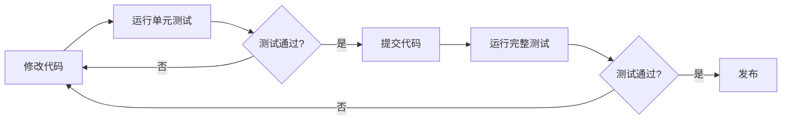

# AI分析质量保证系统 - 操作手册

**版本**: V1.0
**日期**: 2025-01-06
**目标**: 快速参考手册

---

## 📚 目录

1. [快速开始](#快速开始)
2. [日常操作](#日常操作)
3. [常用命令](#常用命令)
4. [监控仪表板](#监控仪表板)
5. [故障排查](#故障排查)
6. [最佳实践](#最佳实践)

---

## 🚀 快速开始

### 3分钟验证系统

```bash
# Step 1: 进入Agent目录
cd C:\data_agent\Agent

# Step 2: 运行测试
python -m pytest tests/unit/test_golden_cases.py -v

# Step 3: 查看结果
# 应该看到: ================== 18 passed in 0.05s ==================
```

**✅ 通过标准**: 所有18个测试用例100%通过

---

## 🔄 日常操作

### 每天下班前（2分钟）

```bash
cd C:\data_agent\Agent

# 查看今日成功率
python -c "from error_tracker import error_tracker; stats = error_tracker.get_error_stats(1); print(f'今日成功率: {stats[\"success_rate\"]:.1f}%')"
```

**阈值**:
- 🟢 **≥95%**: 优秀，无需行动
- 🟡 **80-95%**: 可接受，建议Review错误
- 🔴 **<80%**: 需要立即查看错误日志

### 每周五下午（15分钟）

```bash
cd C:\data_agent\Agent

# 运行完整测试套件
pytest tests/unit -v

# 生成周报
python demo_qa_system.py
# 选择: 3 - 生成错误分析报告

# 查看Top错误
python -c "from error_tracker import error_tracker; print(error_tracker.generate_report(7))"
```

**行动项**:
1. 记录Top 3错误类型
2. 制定下周改进计划
3. 更新测试用例（如有需要）

### 每月初（30分钟）

```bash
# 1. 查看月度趋势
python -c "from error_tracker import error_tracker; print(error_tracker.generate_report(30))"

# 2. 扩充测试用例
# 编辑: Agent/tests/conftest.py
# 添加新的 golden_test_cases

# 3. 运行完整测试
pytest tests/ --cov=Agent --cov-report=html

# 4. 查看覆盖率报告
# 打开: htmlcov/index.html
```

---

## 💻 常用命令

### 测试相关

```bash
# 快速测试（10秒）
cd Agent
pytest tests/unit -v -k "not slow"

# 完整测试（30秒）
pytest tests/unit -v

# 带覆盖率测试
pytest tests/ --cov=Agent --cov-report=term

# 只测试黄金用例
pytest tests/unit/test_golden_cases.py -v

# 运行演示系统
python demo_qa_system.py
```

### 错误追踪

```bash
# 查看最近N天的报告
python -c "from error_tracker import error_tracker; print(error_tracker.generate_report(N))"

# 查看错误统计
python -c "from error_tracker import error_tracker; import json; print(json.dumps(error_tracker.get_error_stats(7), indent=2))"

# 清空错误日志（谨慎使用）
del agent_errors.jsonl agent_success.jsonl
```

### 服务管理

```bash
# 启动后端服务
cd backend
uvicorn src.app.main:app --reload --port 8004

# 检查服务健康
curl http://localhost:8004/health

# 测试AI Agent
curl -X POST "http://localhost:8004/api/v1/llm/query-with-agent" \
  -H "Content-Type: application/json" \
  -d '{"query": "数据库里有哪些表？", "tenant_id": "default", "user_id": "test"}'
```

---

## 📊 监控仪表板

### 核心指标

#### 成功率 (Success Rate)
```bash
python -c "from error_tracker import error_tracker; stats = error_tracker.get_error_stats(7); print(f'成功率: {stats[\"success_rate\"]:.1f}%')"
```

**目标值**:
- P0用例: ≥100%
- P1用例: ≥95%
- 整体: ≥95%

#### 错误分类 (Error Categories)
```bash
python -c "
from error_tracker import error_tracker
import json
stats = error_tracker.get_error_stats(7)
print(json.dumps(stats['category_stats'], indent=2, ensure_ascii=False))
"
```

**常见类别**:
1. **AMBIGUOUS_QUERY**: 问题不明确
2. **DATABASE_CONNECTION**: 数据库连接失败
3. **SCHEMA_NOT_FOUND**: 表或字段不存在
4. **MCP_TOOL_FAILURE**: MCP工具调用失败
5. **LLM_API_ERROR**: AI API错误

#### 响应时间 (Response Time)
```bash
python -c "
from error_tracker import error_tracker
stats = error_tracker.get_error_stats(7)
print(f'平均响应时间: {stats.get(\"avg_response_time\", 0):.2f}秒')
"
```

**基准值**:
- 简单查询: <5秒
- 复杂分析: <10秒
- P95: <10秒

### 实时监控命令

```bash
# 创建监控脚本: watch_qa.bat
@echo off
:loop
cls
echo ===================================
echo AI分析质量实时监控
echo ===================================
echo.
cd C:\data_agent\Agent
python -c "from error_tracker import error_tracker; stats = error_tracker.get_error_stats(1); print(f'今日请求: {stats[\"total\"]}'); print(f'成功: {stats[\"success\"]}'); print(f'失败: {stats[\"failed\"]}'); print(f'成功率: {stats[\"success_rate\"]:.1f}%%')"
echo.
echo 按Ctrl+C退出，或等待10秒自动刷新...
timeout /t 10 /nobreak > nul
goto loop
```

运行监控:
```bash
watch_qa.bat
```

---

## 🔧 故障排查

### 问题1: 测试失败

**症状**: `pytest` 运行时部分测试失败

**检查步骤**:
```bash
# 1. 查看详细错误
pytest tests/unit/test_golden_cases.py -v --tb=long

# 2. 检查依赖
pip list | grep -E "pytest|langchain|openai"

# 3. 重新安装依赖
pip install -r requirements.txt --force-reinstall
```

**常见原因**:
- 依赖版本不匹配
- 测试数据过期
- 环境变量缺失

### 问题2: 日志文件为空

**症状**: `agent_success.jsonl` 和 `agent_errors.jsonl` 都是空的

**检查步骤**:
```bash
# 1. 确认错误追踪已集成
cd backend
grep -n "run_agent_with_tracking" src/app/services/agent_service.py

# 2. 测试错误追踪模块
cd Agent
python -c "from error_tracker import error_tracker; error_tracker.log_success('测试', '成功', context={})"

# 3. 检查文件权限
ls -la agent_*.jsonl
```

**解决方案**:
1. 确保已完成集成（参考 `integration-guide.md`）
2. 检查文件写入权限
3. 手动创建日志文件: `touch agent_success.jsonl agent_errors.jsonl`

### 问题3: API返回500错误

**症状**: 调用 `/api/v1/llm/query-with-agent` 返回500

**检查步骤**:
```bash
# 1. 查看后端日志
cd backend
tail -f logs/app.log  # 如果有日志文件

# 2. 检查环境变量
echo %DATABASE_URL%
echo %ZHIPUAI_API_KEY%

# 3. 测试数据库连接
curl http://localhost:8004/health/database
```

**常见原因**:
- API密钥无效
- 数据库连接失败
- 参数格式错误

---

## ✅ 最佳实践

### 开发流程



### 测试驱动开发 (TDD)

1. **先写测试**: 在 `tests/conftest.py` 添加新用例
2. **运行测试**: 确认新测试失败（红色）
3. **实现功能**: 编写代码使测试通过
4. **验证测试**: 确认测试通过（绿色）
5. **重构代码**: 优化代码质量
6. **再次测试**: 确保重构后仍通过

示例:
```bash
# 1. 添加新测试用例
echo '{"id": "NEW01", "category": "新功能", "question": "测试问题"}' >> tests/conftest.py

# 2. 运行测试（应该失败）
pytest tests/unit/test_golden_cases.py::TestGoldenCases::test_NEW01 -v

# 3. 实现功能
# ... 编写代码 ...

# 4. 再次运行（应该通过）
pytest tests/unit/test_golden_cases.py::TestGoldenCases::test_NEW01 -v
```

### 错误处理策略

1. **立即修复 P0错误** (影响核心功能)
   - 危险操作未拦截
   - 数据安全问题
   - 系统崩溃

2. **24小时内修复 P1错误** (影响用户体验)
   - 模糊问题处理不当
   - 响应时间过长
   - 边界情况未覆盖

3. **一周内优化 P2问题** (改进点)
   - 错误信息不够友好
   - 性能可以优化
   - 测试覆盖率不足

### 代码审查检查清单

提交代码前检查:

- [ ] 所有测试通过 (`pytest tests/ -v`)
- [ ] 代码覆盖率 ≥70% (`pytest --cov`)
- [ ] 无语法错误 (`python -m py_compile 文件`)
- [ ] 日志记录完整（关键操作都有日志）
- [ ] 错误处理健全（try-except块）
- [ ] 文档更新（修改后更新CLAUDE.md）

---

## 📖 参考文档

### 完整指南
- [AI分析QA策略](./ai-analysis-qa-strategy.md) - 完整的测试策略和方法论
- [快速上手指南](./quick-start-testing-guide.md) - 新手教程
- [验证清单](./ai-analysis-verification-checklist.md) - 70+项检查清单
- [集成指南](./integration-guide.md) - 后端集成详细步骤

### 快速参考
- [Agent快速开始](../../Agent/QA_QUICK_START.md) - 3分钟验证
- [实施总结](./implementation-summary.md) - 当前状态和后续路线图

### 外部资源
- [Pytest文档](https://docs.pytest.org/)
- [LangGraph测试](https://langchain-ai.github.io/langgraph/testing/)
- [Python测试最佳实践](https://docs.python-guide.org/writing/tests/)

---

## 🆘 快速求助

### 紧急问题（生产故障）

```bash
# 1. 立即回滚到上一个稳定版本
cd C:\data_agent
git checkout HEAD~1

# 2. 重启服务
cd backend
uvicorn src.app.main:app --port 8004

# 3. 验证服务正常
curl http://localhost:8004/health
```

### 一般问题（功能异常）

```bash
# 1. 查看错误日志
cd Agent
tail -20 agent_errors.jsonl

# 2. 运行诊断
python -c "
from error_tracker import error_tracker
import json
# 最近10条错误
recent_errors = error_tracker.get_recent_errors(10)
print(json.dumps(recent_errors, indent=2, ensure_ascii=False))
"

# 3. 提交Issue
# 包含: 错误日志、复现步骤、环境信息
```

### 性能问题（响应慢）

```bash
# 1. 查看响应时间分布
cd Agent
python -c "
from error_tracker import error_tracker
stats = error_tracker.get_error_stats(7)
print(f'平均响应时间: {stats.get(\"avg_response_time\", 0):.2f}秒')
print(f'P95响应时间: {stats.get(\"p95_response_time\", 0):.2f}秒')
"

# 2. 分析慢查询
# 查看 agent_success.jsonl 中 execution_time > 10s 的记录

# 3. 优化Prompt
# 精简问题描述，减少不必要的上下文
```

---

## 📞 联系方式

**技术支持**:
- 查看文档: `docs/QA/`
- 查看示例: `Agent/demo_qa_system.py`
- 运行测试: `pytest tests/unit/ -v`

**反馈渠道**:
- 提交Issue到项目仓库
- 更新测试用例: `tests/conftest.py`
- 改进文档: `docs/QA/`

---

## ✨ 提示与技巧

### 快速命令别名 (可选)

在 Windows 中创建 `.bashrc` 或 PowerShell Profile:

```powershell
# PowerShell Profile: $PROFILE
function qatest { cd C:\data_agent\Agent; pytest tests/unit -v }
function qareport { cd C:\data_agent\Agent; python demo_qa_system.py }
function qastats { cd C:\data_agent\Agent; python -c "from error_tracker import error_tracker; print(error_tracker.generate_report(7))" }
```

使用:
```powershell
qatest      # 运行测试
qareport    # 生成报告
qastats     # 查看统计
```

### 自动化脚本

创建 `daily_check.bat`:
```batch
@echo off
echo ===== 每日质量检查 =====
cd C:\data_agent\Agent
echo.
echo [1/3] 运行测试...
pytest tests/unit -v --tb=short
echo.
echo [2/3] 查看今日统计...
python -c "from error_tracker import error_tracker; stats = error_tracker.get_error_stats(1); print(f'今日成功率: {stats[\"success_rate\"]:.1f}%%')"
echo.
echo [3/3] Top错误...
python -c "from error_tracker import error_tracker; print(error_tracker.generate_report(1))"
echo.
echo ===== 检查完成 =====
pause
```

### VS Code集成

在 `.vscode/tasks.json` 中添加:
```json
{
  "version": "2.0.0",
  "tasks": [
    {
      "label": "QA: 运行测试",
      "type": "shell",
      "command": "cd Agent && pytest tests/unit -v",
      "group": {
        "kind": "test",
        "isDefault": true
      }
    },
    {
      "label": "QA: 生成报告",
      "type": "shell",
      "command": "cd Agent && python demo_qa_system.py"
    }
  ]
}
```

使用: `Ctrl+Shift+P` → `Tasks: Run Task` → 选择任务

---

**版本**: V1.0
**最后更新**: 2025-01-06
**维护者**: QA Team
**下次更新**: 每月初或重大变更时
