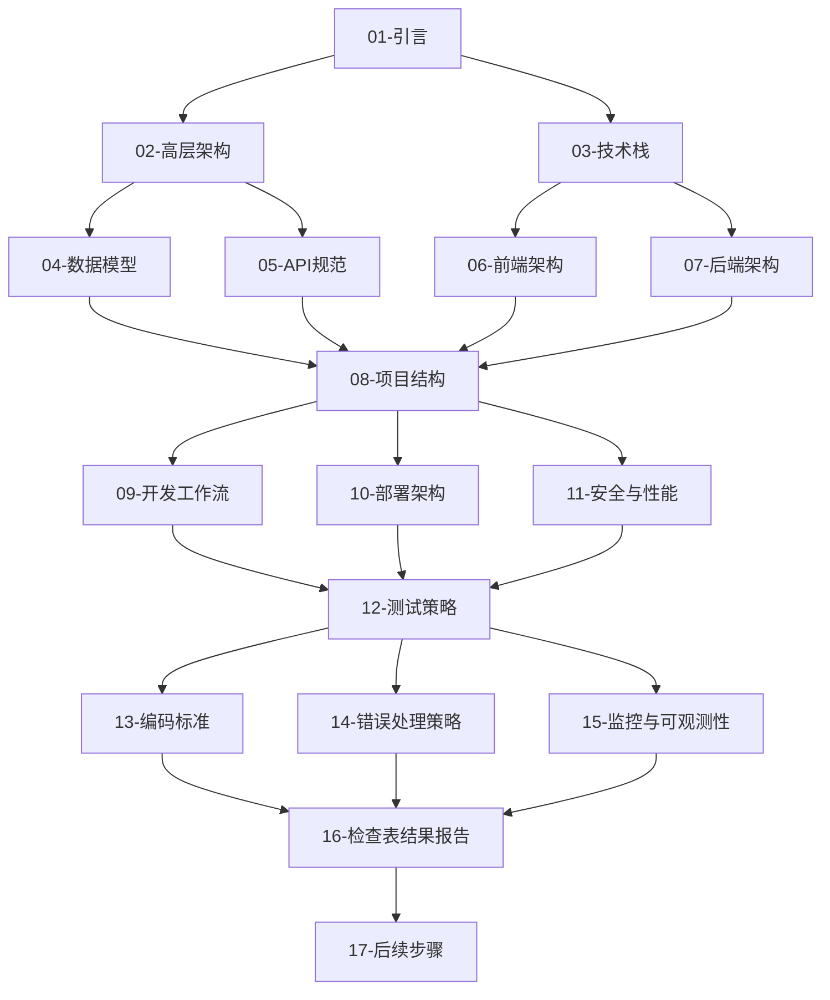

# Data Agent V4 架构文档分片索引

## 文档概述

本目录包含了 Data Agent V4 (SaaS MVP) 完整架构文档的分片版本。原 architecture-v4.md 文档已按照逻辑章节拆分为 17 个独立的分片文件，便于开发团队按需查阅和实施。

## 分片结构

### 📋 基础信息 (第1-3部分)
- **[01-引言.md](./01-引言.md)** - 项目概述、版本信息和目标
- **[02-高层架构.md](./02-高层架构.md)** - 技术摘要、架构图和关键模式
- **[03-技术栈.md](./03-技术栈.md)** - 详细技术选型和版本要求

### 🗄️ 数据和API (第4-5部分)
- **[04-数据模型.md](./04-数据模型.md)** - 数据库设计和租户隔离模型
- **[05-API规范.md](./05-API规范.md)** - OpenAPI 3.0 规范和端点定义

### 🏗️ 系统架构 (第6-8部分)
- **[06-前端架构.md](./06-前端架构.md)** - Next.js 应用结构和认证路由
- **[07-后端架构.md](./07-后端架构.md)** - FastAPI 服务架构和租户隔离
- **[08-项目结构.md](./08-项目结构.md)** - 完整目录结构和环境配置

### 🔧 开发和部署 (第9-11部分)
- **[09-开发工作流.md](./09-开发工作流.md)** - 本地开发环境设置
- **[10-部署架构.md](./10-部署架构.md)** - 生产环境部署策略
- **[11-安全与性能.md](./11-安全与性能.md)** - 安全要求和性能优化

### 🧪 质量保证 (第12-15部分)
- **[12-测试策略.md](./12-测试策略.md)** - 测试方法和覆盖率要求
- **[13-编码标准.md](./13-编码标准.md)** - 开发规范和代码质量
- **[14-错误处理策略.md](./14-错误处理策略.md)** - 错误处理和监控
- **[15-监控与可观测性.md](./15-监控与可观测性.md)** - 监控方法和调试技巧

### 📊 项目管理 (第16-17部分)
- **[16-检查表结果报告.md](./16-检查表结果报告.md)** - 架构验证和合规性检查
- **[17-后续步骤.md](./17-后续步骤.md)** - PO 交接和开发计划

## 文档逻辑关系

## 使用指南

### 🎯 面向不同角色的阅读路径

**产品经理 (PO)**
1. [01-引言.md](./01-引言.md) - 了解项目概览
2. [02-高层架构.md](./02-高层架构.md) - 理解技术决策
3. [17-后续步骤.md](./17-后续步骤.md) - 了解开发计划

**架构师/技术负责人**
1. [02-高层架构.md](./02-高层架构.md) - 理解整体设计
2. [03-技术栈.md](./03-技术栈.md) - 确认技术选型
3. [11-安全与性能.md](./11-安全与性能.md) - 关注非功能性需求
4. [16-检查表结果报告.md](./16-检查表结果报告.md) - 验证架构完整性

**前端开发工程师**
1. [03-技术栈.md](./03-技术栈.md) - 了解前端技术栈
2. [06-前端架构.md](./06-前端架构.md) - 理解前端结构
3. [08-项目结构.md](./08-项目结构.md) - 查看完整目录
4. [13-编码标准.md](./13-编码标准.md) - 遵循编码规范

**后端开发工程师**
1. [03-技术栈.md](./03-技术栈.md) - 了解后端技术栈
2. [04-数据模型.md](./04-数据模型.md) - 理解数据模型
3. [05-API规范.md](./05-API规范.md) - 实现API端点
4. [07-后端架构.md](./07-后端架构.md) - 理解服务架构

**DevOps/部署工程师**
1. [08-项目结构.md](./08-项目结构.md) - 了解项目组织
2. [09-开发工作流.md](./09-开发工作流.md) - 设置开发环境
3. [10-部署架构.md](./10-部署架构.md) - 规划生产部署
4. [15-监控与可观测性.md](./15-监控与可观测性.md) - 配置监控

**测试工程师**
1. [12-测试策略.md](./12-测试策略.md) - 制定测试计划
2. [13-编码标准.md](./13-编码标准.md) - 理解质量要求
3. [14-错误处理策略.md](./14-错误处理策略.md) - 验证错误处理

### 🔄 开发阶段参考

**Phase 1: 基础设施搭建**
- [08-项目结构.md](./08-项目结构.md) - 创建项目结构
- [09-开发工作流.md](./09-开发工作流.md) - 设置开发环境

**Phase 2: 核心功能开发**
- [04-数据模型.md](./04-数据模型.md) - 实现数据模型
- [05-API规范.md](./05-API规范.md) - 开发API端点
- [06-前端架构.md](./06-前端架构.md) - 构建前端界面
- [07-后端架构.md](./07-后端架构.md) - 实现后端服务

**Phase 3: 质量保证**
- [12-测试策略.md](./12-测试策略.md) - 执行测试
- [13-编码标准.md](./13-编码标准.md) - 代码审查
- [11-安全与性能.md](./11-安全与性能.md) - 性能优化

**Phase 4: 部署上线**
- [10-部署架构.md](./10-部署架构.md) - 生产部署
- [15-监控与可观测性.md](./15-监控与可观测性.md) - 监控配置

## 关键依赖关系

### 🔗 技术依赖
- **认证系统** ([06-前端架构.md](./06-前端架构.md), [07-后端架构.md](./07-后端架构.md)) → **租户隔离** ([04-数据模型.md](./04-数据模型.md))
- **数据模型** ([04-数据模型.md](./04-数据模型.md)) → **API设计** ([05-API规范.md](./05-API规范.md))
- **技术栈** ([03-技术栈.md](./03-技术栈.md)) → **项目结构** ([08-项目结构.md](./08-项目结构.md))

### 📋 流程依赖
- **编码标准** ([13-编码标准.md](./13-编码标准.md)) → **测试策略** ([12-测试策略.md](./12-测试策略.md))
- **错误处理** ([14-错误处理策略.md](./14-错误处理策略.md)) → **监控** ([15-监控与可观测性.md](./15-监控与可观测性.md))
- **开发工作流** ([09-开发工作流.md](./09-开发工作流.md)) → **部署架构** ([10-部署架构.md](./10-部署架构.md))

## 版本信息

- **原架构文档**: Data Agent V4 (SaaS MVP) - architecture-v4.md
- **分片版本**: 1.0
- **创建日期**: 2025年11月16日
- **分片工具**: BMad Master Shard Doc Task
- **总分片数**: 17个
- **适用阶段**: MVP开发

## 联系和支持

如有文档相关问题或需要架构澄清，请参考：
1. **原完整文档**: `../architecture.md`
2. **产品需求**: `../prd-v4.md`
3. **项目指导**: 项目 PO 或架构师 Winston

---

*本文档索引由 BMad Master 自动生成，确保分片文档的逻辑一致性和可导航性。*