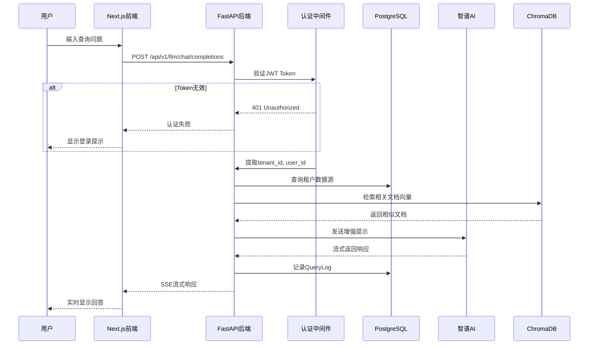
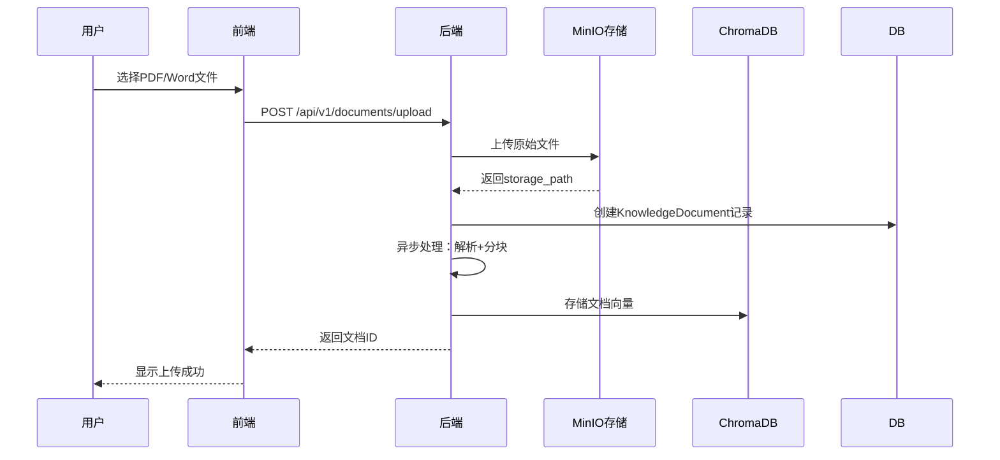

# 📋 系统架构与维护指南

## Data Agent V4 - 逆向工程分析报告

**分析日期**: 2025-11-28
**项目版本**: V4.1 (SaaS MVP)
**技术栈**: Next.js 14 + FastAPI + PostgreSQL/SQLite + Docker

---

## 1. 💾 数据库与数据模型透视 (The Data Truth)

### 1.1 实体关系图 (ER Diagram)

```mermaid
erDiagram
    Tenant ||--o{ DataSourceConnection : "has"
    Tenant ||--o{ KnowledgeDocument : "owns"
    Tenant ||--o{ QueryLog : "generates"
    Tenant ||--o{ ExplanationLog : "has"
    Tenant ||--o{ FusionResult : "produces"
    Tenant ||--o{ ReasoningPath : "contains"

    QueryLog ||--o{ ExplanationLog : "explains"
    QueryLog ||--o{ FusionResult : "fuses"
    QueryLog ||--o{ ReasoningPath : "reasons"

    ExplanationLog ||--o{ FusionResult : "details"
    ExplanationLog ||--o{ ReasoningPath : "paths"

    Tenant {
        String id PK "String(255) - 非UUID!"
        String email UK "必填"
        String name "必填"
        Enum status "TenantStatus枚举"
        JSONB settings "租户配置"
        DateTime created_at
        DateTime updated_at
    }

    DataSourceConnection {
        UUID id PK
        String tenant_id FK
        String name "必填"
        String db_type "postgresql/mysql等"
        String _connection_string "加密存储"
        Enum status "DataSourceConnectionStatus"
        String host "解析自连接字符串"
        Integer port
        String database_name
        DateTime last_tested_at
        JSONB test_result
        Boolean is_active
    }

    KnowledgeDocument {
        UUID id PK
        String tenant_id FK
        String file_name "必填"
        String file_type "pdf/docx等"
        Integer file_size
        String storage_path "MinIO路径"
        Enum status "DocumentStatus"
        JSONB metadata
        Integer chunk_count
        DateTime processed_at
    }

    QueryLog {
        UUID id PK
        String tenant_id FK
        String user_id "来自JWT"
        Text question "必填"
        Enum query_type "QueryType枚举"
        JSONB context
        JSONB options
        Text response_summary
        JSONB response_data
        Enum status "QueryStatus"
        Float execution_time_ms
        Integer token_usage
    }

    ExplanationLog {
        BigInteger id PK "自增"
        String tenant_id FK
        UUID query_id FK
        Text explanation "必填"
        JSONB reasoning_steps
        Float confidence_score
        JSONB sources
        JSONB metadata
    }

    FusionResult {
        BigInteger id PK "自增"
        String tenant_id FK
        UUID query_id FK
        BigInteger explanation_id FK
        JSONB fusion_metadata
        JSONB processing_pipeline
        Integer source_data_count
        Integer conflicts_detected
        JSONB conflict_details
        Integer fusion_confidence_score "0-100"
    }

    ReasoningPath {
        BigInteger id PK "自增"
        String tenant_id FK
        UUID query_id FK
        BigInteger explanation_id FK
        Integer step_number
        String title "必填"
        Text description "必填"
        JSONB evidence
        Integer confidence "0-100"
        BigInteger parent_step_id
    }
```



### 1.2 类型兼容性诊断

| 问题类型 | 位置 | 严重程度 | 描述 |
|---------|------|----------|------|
| **主键类型不一致** | `models.py:Tenant` | 🔴 高 | Tenant使用`String(255)`作为主键，而其他表使用`UUID`。SQL脚本中Tenant使用UUID。 |
| **SQL脚本与ORM不匹配** | `init-db.sql` vs `models.py` | 🔴 高 | SQL定义了`slug`字段和`users`表，但ORM中不存在 |
| **JSONB兼容性** | 多处 | 🟡 中 | SQLite不支持JSONB，会降级为JSON，可能导致查询行为差异 |
| **DateTime时区** | 多处 | 🟡 中 | 使用`DateTime(timezone=True)`，SQLite不完全支持时区 |
| **枚举类型** | 多处 | 🟡 中 | Python Enum与PostgreSQL Enum需要Alembic迁移同步 |

### 1.3 幽灵关联与可疑字段

**动态添加反向关系 - 潜在循环导入风险**
```python
# 位置: backend/src/app/data/models.py 第737-752行
if hasattr(Tenant, '__table__'):
    Tenant.explanation_logs = relationship("ExplanationLog", back_populates="tenant", cascade="all, delete-orphan")
    Tenant.fusion_results = relationship("FusionResult", back_populates="tenant", cascade="all, delete-orphan")
    Tenant.reasoning_paths = relationship("ReasoningPath", back_populates="tenant", cascade="all, delete-orphan")
```

**可疑的Nullable字段**（业务上应为必填）:

| 字段 | 模型 | 当前设置 | 建议 |
|------|------|----------|------|
| `response_summary` | QueryLog | `nullable=True` | 查询完成后应必填 |
| `execution_time_ms` | QueryLog | `nullable=True` | 应有默认值0 |
| `chunk_count` | KnowledgeDocument | `nullable=True` | 处理后应必填 |

---

## 2. 📡 API契约审计 (The Contract Truth)

### 2.1 前后端类型对比

| API端点 | 后端定义 | 前端定义 | 状态 | 风险 |
|---------|----------|----------|------|------|
| `GET /data-sources` | `List[DataSourceResponse]` | `DataSourceConnection[]` | ⚠️ 部分匹配 | 字段名差异 |
| `POST /data-sources` | `DataSourceCreateRequest` | `CreateDataSourceRequest` | ✅ 匹配 | - |
| `POST /data-sources/test` | `ConnectionTestRequest` | `ConnectionTestRequest` | ✅ 匹配 | - |
| `GET /documents` | `List[DocumentResponse]` | `any[]` | 🔴 不安全 | 类型丢失 |
| `POST /llm/chat/completions` | `ChatCompletionResponse` | 混合类型 | ⚠️ 复杂 | 流式/非流式差异 |

### 2.2 API客户端重复问题

项目中存在**3个独立的API客户端实现**：

```typescript
// 主API客户端 - frontend/src/lib/api-client.ts (355行)
class ApiClient {
  private baseURL: string
  private getAuthToken(): string | null {
    // 开发环境硬编码token
    if (!token && process.env.NODE_ENV === 'development') {
      token = 'dev_token'  // 🔴 安全风险
    }
  }
}
```

```typescript
// 重复的API客户端 - frontend/src/store/dataSourceStore.ts (第99-207行)
class ApiClient {
  private baseURL: string
  constructor() {
    this.baseURL = process.env.NEXT_PUBLIC_API_URL || 'http://localhost:8004/api/v1'
  }
  // 与api-client.ts功能重复
}
```

**建议**: 统一使用单一API客户端，删除重复实现。

### 2.3 类型安全问题

```typescript
// 类型不安全示例 - frontend/src/lib/api-client.ts
async getDataSources(): Promise<ApiResponse<any[]>> {  // 🔴 使用any
    return this.request<any[]>('/data-sources')
}
```

---

## 3. 🔄 核心业务链路还原 (User Flows)

### 3.1 用户查询数据流程



### 3.2 文档上传流程



### 3.3 痛点分析 - Bug高发环节

| 环节 | 风险等级 | 问题描述 | 建议 |
|------|----------|----------|------|
| **认证中间件** | 🔴 高 | `current_user`类型不一致（Dict vs Tenant对象） | 统一返回类型 |
| **租户隔离** | 🔴 高 | 部分端点从query参数获取tenant_id而非JWT | 强制从JWT提取 |
| **流式响应** | 🟡 中 | SSE连接中断后无重连机制 | 添加重试逻辑 |
| **文档处理** | 🟡 中 | 大文件处理可能超时 | 使用后台任务队列 |

---

## 4. 💀 僵尸代码与技术债 (Code Hygiene)

### 4.1 重复配置文件

项目中存在**两个配置文件**，可能导致混淆：

| 文件 | 用途 | 问题 |
|------|------|------|
| `backend/src/app/core/config.py` | 主配置（299行） | ✅ 正在使用 |
| `backend/src/core/config.py` | 旧配置（~70行） | 🔴 包含硬编码默认值 |

```python
# 旧配置文件 - backend/src/core/config.py 包含不安全的默认值
SECRET_KEY: str = "your-secret-key-here-change-in-production"  # 🔴 硬编码
MINIO_ACCESS_KEY: str = "minioadmin"  # 🔴 默认凭证
MINIO_SECRET_KEY: str = "minioadmin"  # 🔴 默认凭证
```

### 4.2 硬编码敏感信息

| 位置 | 类型 | 严重程度 | 描述 |
|------|------|----------|------|
| `.env.backup.20251117_174809` | API密钥 | 🔴 严重 | 包含真实的智谱AI API密钥 |
| `docker-compose.yml:81` | 数据库密码 | 🟡 中 | `POSTGRES_PASSWORD: password` |
| `docker-compose.yml:42-43` | 数据库连接 | 🟡 中 | 硬编码用户名密码 |
| `frontend/src/lib/api-client.ts` | 开发Token | 🟡 中 | `token = 'dev_token'` |

```yaml
# 硬编码的数据库凭证 - docker-compose.yml 第79-81行
environment:
  POSTGRES_DB: dataagent
  POSTGRES_USER: postgres
  POSTGRES_PASSWORD: password  # 🔴 应使用环境变量
```

### 4.3 潜在N+1查询问题

```python
# backend/src/app/services/query_optimization_service.py 第210-214行
# 循环中调用to_dict()可能触发懒加载
documents_data = []
for doc in documents:
    doc_dict = doc.to_dict()  # 如果to_dict访问关联对象，可能触发N+1
    documents_data.append(doc_dict)
```

### 4.4 魔法数字

| 位置 | 值 | 建议 |
|------|-----|------|
| `config.py:24` | `ACCESS_TOKEN_EXPIRE_MINUTES=43200` | 提取为常量 `8_DAYS_IN_MINUTES` |
| `models.py:634-636` | `0-100` 分数范围 | 定义为常量或使用Pydantic约束 |
| `llm.py` | 多处超时值 | 统一配置管理 |

---

## 5. 🏗️ 架构亮点

尽管存在上述问题，项目也有值得肯定的设计：

| 亮点 | 描述 |
|------|------|
| ✅ **加密存储** | 数据源连接字符串使用`encryption_service`加密存储 |
| ✅ **配置验证** | `config.py`中有完善的密钥强度验证 |
| ✅ **多租户隔离** | 数据模型设计支持完整的租户隔离 |
| ✅ **密钥轮换** | 实现了密钥轮换提醒机制 |
| ✅ **双数据库支持** | 支持SQLite（开发）和PostgreSQL（生产） |

---

## 6. 📋 修复优先级建议

### 🔴 紧急 (P0)
1. 删除 `.env.backup.*` 文件中的真实API密钥
2. 统一Tenant主键类型（建议改为UUID）
3. 修复认证中间件的类型不一致问题

### 🟡 重要 (P1)
1. 删除重复的配置文件 `backend/src/core/config.py`
2. 统一前端API客户端实现
3. 将docker-compose.yml中的硬编码密码改为环境变量

### 🟢 改进 (P2)
1. 添加前端TypeScript严格类型定义
2. 优化N+1查询问题
3. 提取魔法数字为常量

---

**报告生成完毕。如需深入分析任何特定模块，请告知。**